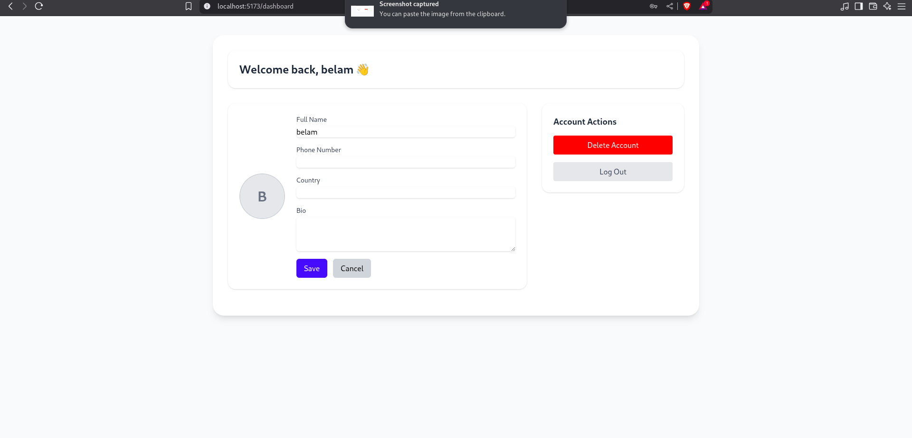

# User Management Project

This project implements a comprehensive user management system, providing administrators with the necessary functionalities to effectively manage users within an application.

## Key Features

* **User Registration:** Enables new users to create accounts, typically involving self-registration with email verification or direct administrator creation.
* **Login and Authentication:** Securely authenticates users, granting them access to the application.
* **User Profile Management:** Allows users to view and update their account information. Administrators may also have access to manage user profiles.
* **Admin User Management:** Provides administrative tools to:
    * Create new user accounts.
    * List existing non-administrator users.
    * Update user status (active/inactive, verified/unverified, staff/non-staff).
* **Logout Functionality:** Enables users to securely log out of their sessions.
* **API Endpoints:** Offers a set of API endpoints for interacting with user data and authentication processes.

## Technologies Used

* **Backend:** Django, REST Framework
* **Frontend:** React, Tailwind CSS
* **Database:** PostgreSQL

## Setup and Installation

1.  **Clone the frontend repository:**
    ```bash
    git clone git@github.com:bmuia/user-management-frontend.git
    cd user-management-frontend
    ```

2.  **Set up the backend:**
    * Clone the backend repository:
        ```bash
        git clone git@github.com:bmuia/user_management_backend.git
        cd user_management_backend
        ```
    * Create and activate a virtual environment:
        ```bash
        python -m venv myenv
        source myenv/bin/activate  # On Linux/macOS
        # myenv\Scripts\activate  # On Windows
        ```
    * Install backend dependencies:
        ```bash
        pip install -r requirements.txt
        ```
    * Create a `.env` file in the backend root directory and configure environment variables (replace placeholders with your actual values):
        ```env
        # --- Deployment Environment ---
        ENVIRONMENT=development

        # --- Django Secret Key ---
        DJANGO_SECRET=your_django_key

        # --- Frontend Configuration ---
        FRONTEND_URL=http://localhost:5173/

        ALLOWED_HOSTS=localhost,127.0.0.1

        CORS_ALLOWED_ORIGINS=http://localhost:5173

        CSRF_TRUSTED_ORIGINS=http://localhost:5173

        # --- PostgreSQL (Production) ---
        DATABASE_URL=your productional_url

        # --- PostgreSQL (Development fallback) ---
        DB_NAME=your_db_name
        DB_USER=your_db_user
        DB_PASSWORD=your_db_password
        DB_HOST=localhost
        DB_PORT=5432

        # --- Email (SMTP) ---
        EMAIL_HOST_USER=your_email
        EMAIL_HOST_PASSWORD=your_app_password # Note: If you use Gmail, you might need an App Password
        ```
    * Apply database migrations:
        ```bash
        python manage.py migrate
        ```
    * Create an administrative superuser:
        ```bash
        python manage.py createsuperuser
        ```
    * Start the backend development server:
        ```bash
        python manage.py runserver
        ```

3.  **Set up the frontend:**
    * Navigate to the frontend directory:
        ```bash
        cd ../user-management-frontend
        ```
    * Install frontend dependencies:
        ```bash
        npm install  # or yarn install
        ```
    * Start the frontend development server:
        ```bash
        npm start    # or yarn start
        ```
    * Ensure the `API_URL` in your frontend configuration (`config/apiConfig.js` or similar) points to your backend server (e.g., `http://localhost:8000/`).

## API Endpoints

* `POST /accounts/pre-register/`: Registers a new user and sends a verification email.
* `POST /accounts/verify-email/`: Verifies a user's email using a provided token.
* `POST /accounts/login/`: Authenticates a user and returns access and refresh tokens.
* `POST /accounts/logout/`: Invalidates the user's refresh token.
* `GET /accounts/me/`: Retrieves the authenticated user's profile information.
* `PUT /accounts/me/`: Updates the authenticated user's profile information.
* `DELETE /accounts/me/`: Deactivates the authenticated user's account.
* `GET /accounts/profiles/`: (Admin only) Lists all non-administrator user profiles.
* `POST /accounts/admin/register/user/`: (Admin only) Creates a new user account.
* `PUT /accounts/admin/<user_id>/update/`: (Admin only) Updates a specific user's information, including status and staff roles.

## Screenshots





## Usage

* **User Registration:** New users register via the registration page. An email containing a verification link is sent to the provided email address (remember to check the spam folder).
* **Email Verification:** Users must click the verification link in the email to activate their account. Upon successful verification, they are redirected to the login page.
* **User Login:** Verified users can log in using their registered email and password. After successful authentication, they are directed to their user dashboard.
* **Administrator Login:** Administrators log in using their credentials. Upon successful login, they are directed to the admin dashboard.
* **Admin Dashboard:** Administrators can view and manage non-administrator users, including creating new accounts and editing existing ones (verifying emails, changing staff status, and activating/deactivating accounts).

## Further Development

* Implement Google Authentication for streamlined registration and login.
* Implement a password reset mechanism for users who have forgotten their passwords.
* Introduce Role-Based Access Control (RBAC) for more fine-grained permission management.
* Enhance the admin dashboard with user search and filtering functionalities.

## Contributing

Contributions are welcome! Please fork the repository and submit pull requests with your proposed changes. Ensure that your code adheres to the project's coding standards.

## Demo

[DEMO](https://user-management-frontend-ten.vercel.app/)

## License

[MIT](LICENSE)